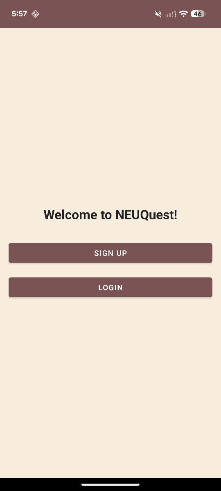
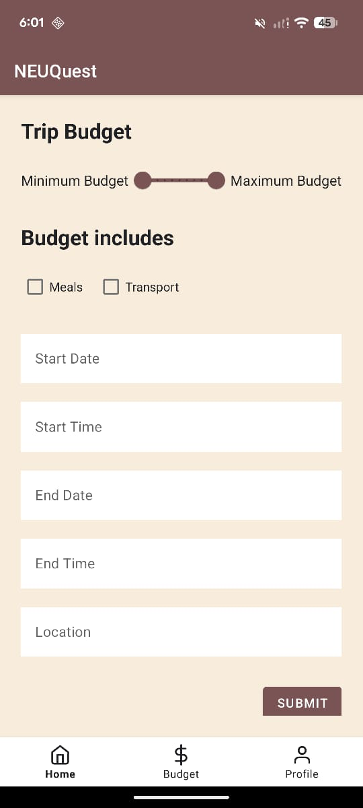
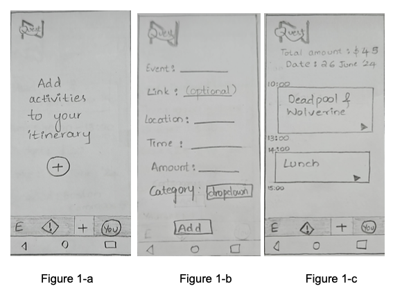
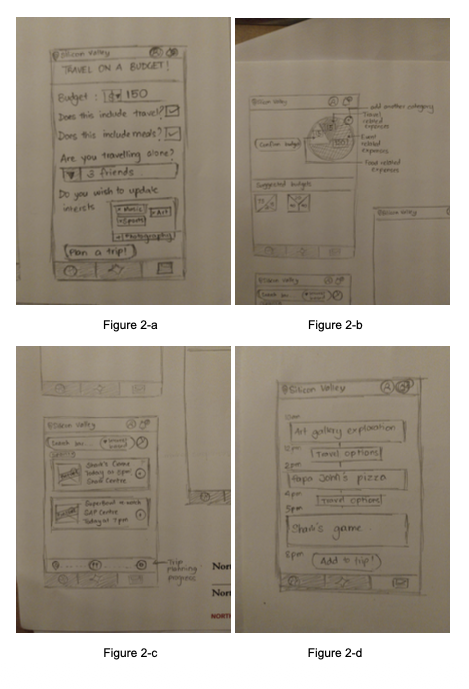
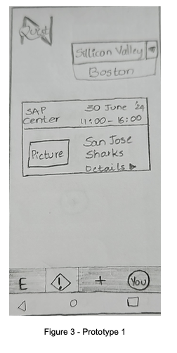
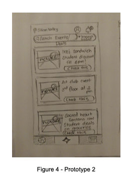
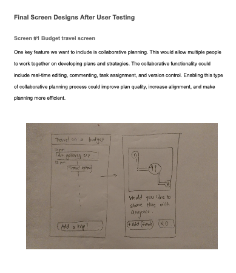
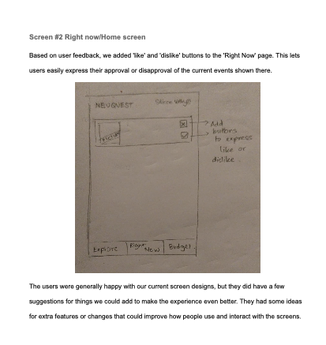

# NEUQuest — Where Budget Meets Adventure

> A cross-platform event discovery and trip planning app exclusively for Northeastern University students. Discover affordable events, plan budget trips with AI assistance, and connect with the NEU community — on Android and iOS.

[](android/)
[](ios/)
[](https://firebase.google.com)
[](https://ai.google.dev)
[](#license)

Both platforms talk to the same Firebase project (Auth, Realtime DB, Storage) and the same Gemini 1.5 Flash model for AI-ranked event feeds and AI-generated trip names. Per-platform READMEs: [`android/README.md`](android/README.md) · [`ios/README.md`](ios/README.md).

---

## Screenshots

### Android app (shipped)

| Welcome | Trip Planner | Profile |
|:-:|:-:|:-:|
|  |  |  |

Captured from the Android client.

### Early wireframes & prototypes

Pen-and-paper sketches from the July 2024 design phase — preserved as portfolio context for the iterative design process. See [docs/decisions.md, ADR-009](docs/decisions.md#adr-009--wireframes-preserved-in-screenshots-not-deleted) for why these stay alongside the real captures.

| Trip itinerary builder | Add-activity flow | Trip summary |
|:-:|:-:|:-:|
|  |  |  |

| Onboarding & budget | Activity detail | Settings & profile |
|:-:|:-:|:-:|
|  |  |  |

---

## Features

### Explore & Discover
- **Right Now** feed: real-time events ranked by AI (Google Gemini 1.5 Flash)
- Category chips: Art, Nature, Photography, Travel, Music, Movies, Food, Sports
- Full-text search with live filtering
- Event cards: image, location, price, date/time at a glance

### Event Details & Registration
- Full event detail: description, pricing, location, date range, register link
- Comment system for community discussion
- Report suspicious events → admin moderation queue

### Budget Trip Planner
- AI-generated trip names via Gemini
- Date range picker with start/end time
- Range slider: min/max budget ($0–$1000)
- Toggle: include meals / include transport
- Auto-matches events within trip date range and budget
- Timeline view of your trip itinerary

### Personalized Feed
- Gemini ranks events based on your registered events + declared interests
- Interest tags: Art, Nature, Photography, Travel, Music, Movies, Food, Sports
- Like/dislike signals fine-tune recommendations over time

### Profiles
- Photo upload (camera or gallery)
- Campus selection, interest editing
- Planned trips overview
- Events attended history

### Auth & Security
- Email/password with mandatory email verification
- Only `@northeastern.edu` and `@husky.neu.edu` addresses accepted
- Role-based admin access (managed at signup)

### Admin Console
- Review reported events
- Approve or remove flagged content
- Add new events to the platform

---

## Architecture

```
NEUQuest/
├── android/                    Java + Material 3 + Activities client (production)
│   └── app/src/main/java/edu/northeastern/numad24su_group9/
│       ├── model/              Event · Trip · User · Comment
│       ├── firebase/           Auth · Database · Storage connectors + repositories
│       ├── gemini/             GeminiClient (AI ranking + trip naming)
│       └── recycler/           ListAdapter + DiffUtil for all 5 RecyclerViews
├── ios/                        SwiftUI + MVVM client (in progress)
│   └── NEUQuest/
│       ├── Models/             Codable structs
│       ├── Services/           @MainActor singletons (Firebase, Gemini)
│       ├── ViewModels/         @MainActor ObservableObject, @Published state
│       ├── Views/              Zero business logic, grouped by feature
│       └── Utils/              AppTheme, Extensions
├── docs/                       Wireframes + prototypes
├── Screenshots/                Top-level captures referenced by this README
└── README.md
```

Two rules every platform obeys:
1. **Firebase is the single source of truth.** No domain state is persisted client-side — every read/write goes through Realtime Database, Auth, or Storage.
2. **Models → Services → ViewModels → Views.** Views never call Firebase or Gemini directly; they read from `@Published` state on a ViewModel.

### Shared Database Schema

```
/users/{uid}
  name, campus, profileImage, isAdmin
  interests: [string]
  plannedTrips: [tripID]
  eventsAttended: [eventID]

/events/{eventID}
  title, description, category, location, price
  startDate (dd/MM/yyyy), endDate, startTime (HH:mm), endTime
  image, registerLink, createdBy, isReported
  comments/{commentID}: text, commenterName, timestamp

/trips/{tripID}
  title, location, minBudget, maxBudget
  startDate, endDate, startTime, endTime
  mealsIncluded, transportIncluded
  eventIDs: [eventID]
```

---

## Design System

Brand decisions live in `Utils/AppTheme.swift` (iOS) and `res/values/colors.xml` + `themes.xml` (Android). The two clients are visually different today — see [docs/decisions.md, ADR-010](docs/decisions.md#adr-010--different-color-palettes-between-android-and-ios-today) for the honest story.

### Android (Material 3, currently shipping)

| Token | Hex | Role |
|---|---|---|
| Dusty rose | `~#7A5C58` | Primary CTAs, app bar |
| Cream | `~#F4EAD7` | Background |
| Navy ink | `~#1A1A1A` | Text |

### iOS (original spec, currently in `AppTheme.swift`)

| Token | Hex | Role |
|---|---|---|
| NEU Red | `#CC0000` | Primary CTAs, brand mark |
| Dark Navy | `#0A1628` | Headers, key surfaces |
| Gold | `#FFD700` | Accent / highlight |
| Surface | `systemBackground` | Adaptive light/dark |

**Typography** — SF Rounded (iOS) / Material rounded (Android). Sizes: `largeTitle 34 · title 28 · title2 22 · title3 20 · headline 17 · body 17 · callout 16 · subheadline 15 · footnote 13 · caption 12 · caption2 11`.

**Spacing** — 4-point grid: `xxs 4 · xs 8 · sm 12 · md 16 · lg 20 · xl 24 · xxl 32 · xxxl 48`.

**Radius** — `sm 8 · md 12 · lg 16 · xl 20 · pill 999`.

**Reusable modifiers (iOS)** — `.cardStyle()` · `.primaryButton()` · `.secondaryButton()` · `.chipStyle(isSelected:)`.

---

## Tech Stack

### Backend (shared)

| Service | Usage |
|---|---|
| Firebase Authentication | Email/password, email verification, role-based access |
| Firebase Realtime Database | Events, Trips, Users, Comments — real-time sync |
| Firebase Storage | Event images, user profile photos |
| Google Gemini 1.5 Flash | AI event ranking, AI trip name generation |

### Android

| Layer | Technology |
|---|---|
| Language | Java 8 |
| Min SDK | API 27 (Android 8.1) |
| Target SDK | API 34 (Android 14) |
| UI | Material Design 3, XML layouts, ViewBinding |
| Architecture | MVC with MVVM infrastructure (ViewBinding + Lifecycle) |
| Async | ThreadPoolExecutor + Firebase Tasks |
| Image loading | Glide + Picasso |
| AI | Gemini 1.5 Flash via Guava `ListenableFuture` |
| Testing | JUnit + Espresso (30 unit tests) |

### iOS

| Layer | Technology |
|---|---|
| Language | Swift 5.9 |
| Min target | iOS 17 |
| UI | SwiftUI |
| Architecture | MVVM (strict — zero logic in views) |
| State | Combine + `@Published` |
| Async | Swift Concurrency (`async/await`, `@MainActor`) |
| Persistence | UserDefaults + JSONEncoder |
| AI | Gemini 1.5 Flash via URLSession |

---

## Getting Started

### Android

```bash
git clone https://github.com/Kaustubha-09/NEUQuest.git
cd NEUQuest/android

# Add your google-services.json to app/
./gradlew assembleDebug

# Run tests
./gradlew test
```

### iOS

```bash
cd NEUQuest/ios
open NEUQuest.xcodeproj
# Select an iPhone simulator (iOS 17+) and press ⌘R
```

- Firebase: add `GoogleService-Info.plist` to the iOS target.
- Gemini: add your API key to `Services/GeminiService.swift`.

See [`android/README.md`](android/README.md) and [`ios/README.md`](ios/README.md) for full platform setup.

---

## Demo Credentials

| Field | Value |
|---|---|
| Email | `demo@northeastern.edu` |
| Password | `demo1234` |

The app ships with full mock data — no Firebase setup needed for UI development.

---

## Platform Status

| Platform | Language | Framework | Status |
|---|---|---|---|
| Android | Java | Activities + Material 3 | Complete |
| iOS | Swift | SwiftUI + MVVM | In progress |
| Web | TypeScript | Next.js + React | Planned |

---

## Roadmap

- [ ] Android → Kotlin + Jetpack Compose migration
- [ ] iOS App Store submission
- [ ] Web app (Next.js + Firebase)
- [ ] Push notifications (FCM / APNs)
- [ ] Google Maps integration for event locations
- [ ] Like/dislike system for feed personalization
- [ ] Budget pie chart visualization
- [ ] Calendar app integration
- [ ] Social features (friends, shared trips)
- [ ] CI/CD with GitHub Actions

---

## Project Stats

| Metric | Android | iOS |
|---|---|---|
| Source files | 36 Java | 35+ Swift |
| Unit tests | 30 | In progress |
| Third-party deps | 6 | 0 |
| AI integration | Gemini 1.5 Flash | Gemini 1.5 Flash |

---

## Tradeoffs

- **Two native clients, not one cross-platform codebase.** Course required platform-native development. Cost: features land twice. Benefit: idiomatic UX on both platforms.
- **Single Firebase project.** Schema is the contract. Cross-client features come free; schema changes coordinate across both clients.
- **Domain gating at the client.** Cheap and works for non-malicious users. Backstop is Realtime Database security rules. Determined attackers can still bypass the client check — see [ADR-003](docs/decisions.md#adr-003--neu-domain-gating-at-the-client-layer).
- **Gemini API key in the client binary.** Demo-grade. Production fix is a Firebase Cloud Function proxy. Tracked explicitly in [ADR-008](docs/decisions.md#adr-008--gemini-api-key-in-the-client-binary).
- **Color palette drift.** Android moved to a softer Material 3 dusty rose during theme migration; iOS stayed on the original NEU Red. Documented, not pretended otherwise — see [ADR-010](docs/decisions.md#adr-010--different-color-palettes-between-android-and-ios-today).
- **Activities, not Fragments, on Android.** Simpler at this scope; future Kotlin + Compose migration replaces this.
- **iOS still has mock services in places.** Full Firebase wire-up is roadmap Phase 2.

Full ADR set in [docs/decisions.md](docs/decisions.md). Honest limitations list in [docs/limitations.md](docs/limitations.md).

---

## Quality Gates

- Android: `./gradlew assembleDebug` passes; **30 unit tests** (date-range matching, sort ordering, NEU email validation, trip null-safety, AppConstants sanity).
- Android: all RecyclerView adapters use `ListAdapter` + `DiffUtil` — no `notifyDataSetChanged()`.
- Android: `setPersistenceEnabled(true)` in `NEUQuestApplication` — Firebase caches to disk.
- iOS: `xcodebuild build` against iOS 17 sim SDK.
- iOS: zero-hex-literal policy outside `Utils/AppTheme.swift`.
- Both: NEU email gating (`@northeastern.edu` / `@husky.neu.edu`) at signup.
- Both: Gemini calls bounded to event ranking + trip naming — never on critical paths.
- Both: portrait-only on iPhone; default Android orientation behavior.

---

## Resume Bullets

- Built a **cross-platform mobile app for the Northeastern community** with native Android (**Java + Material 3**) and native iOS (**SwiftUI + MVVM**) clients sharing one Firebase project (Auth + Realtime Database + Storage) and one Gemini 1.5 Flash model for AI ranking and trip naming.
- On Android, shipped **MVC with MVVM infrastructure**: `ListAdapter` + `DiffUtil` across all five `RecyclerView`s, Firebase offline persistence enabled, `ThreadPoolExecutor` for background work, **30 unit tests** covering date-range matching, sort ordering, NEU email validation, and `AppConstants` sanity.
- On iOS, **strict MVVM**: `@MainActor` `ObservableObject` ViewModels with `@Published` state, Combine for stream operators, `async/await` for HTTP, zero business logic in views.
- Designed **layered NEU-domain auth**: client-side email regex check + Realtime Database security rules requiring `auth.token.email` to end in `.edu` — neither layer alone is sufficient.
- Integrated **Gemini 1.5 Flash for AI ranking + trip-name generation** without putting it in critical paths — failures degrade gracefully to chronological feeds + user-typed names.
- **Documented engineering drift** publicly: Gemini key in client binary (ADR-008), Android/iOS palette divergence after Material 3 migration (ADR-010), iOS mock-service residue (roadmap Phase 2) — written as ADRs, not hidden as TODOs.

---

## Interview Talking Points

**Why two native clients instead of React Native or Flutter.** The course required platform-native development, but I'd defend the choice anyway. Material 3 conventions and SwiftUI conventions diverge enough that a cross-platform layer ends up either lowest-common-denominator (bad UX on both) or duplicated platform-specific code (no win on dev velocity). Two narrow native clients sharing a single backend schema gave us idiomatic UX with one source of truth for data.

**Layered defense for NEU email gating.** The client-side regex is cheap and catches every non-malicious signup. But anyone can hit the Firebase REST API directly, so the layer that *actually* enforces the rule is Realtime Database security rules — `auth.token.email` must end in `.edu`. Neither layer alone is enough; the client check keeps the UI flow tight, the DB rule keeps the data clean.

**`ListAdapter` over `notifyDataSetChanged()`.** All five Android `RecyclerView` adapters extend `ListAdapter<T, VH>` with a typed `DiffUtil.ItemCallback`. `submitList()` drives every update. Item-level diffing animates only the changed cells. The "cost" is two lines per model (`areItemsTheSame`, `areContentsTheSame`); the payoff is correct list animations and no full re-bind on every change.

**Firebase offline persistence as a UX feature, not a flag.** `setPersistenceEnabled(true)` in `NEUQuestApplication`. Cold-launch shows the previous session's data while the network sync runs in the background. The few-MB disk cost is invisible; the alternative is a blank loading state on every app open.

**Gemini API key in the binary, and saying so.** Demo-grade. A real deployment proxies through a Cloud Function so the key never ships in the APK. I documented this in [ADR-008](docs/decisions.md#adr-008--gemini-api-key-in-the-client-binary) rather than hiding it — being honest about the gap matters more than pretending it's perfect.

**Wireframes preserved alongside screenshots.** `04_capture_*.png` files are pen-and-paper sketches from the July 2024 design phase. They live next to the real captures because they show the design iteration. Most repos either delete these (loses context) or hide them in `docs/` (loses chronological order). We labeled them clearly and let them stand.

---

## Team

**Group 9 — Northeastern University · NUMAD24Su**

- Agllai Papaj
- Harshitha Chava
- Kaustubha Eluri
- Sampada Kulkarni
- Winston Heinrichs

**Course:** Mobile Application Development (NUMAD24Su) · Northeastern University · Summer 2024

---

## License

Developed as a university course project. MIT License.
