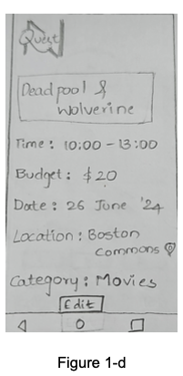
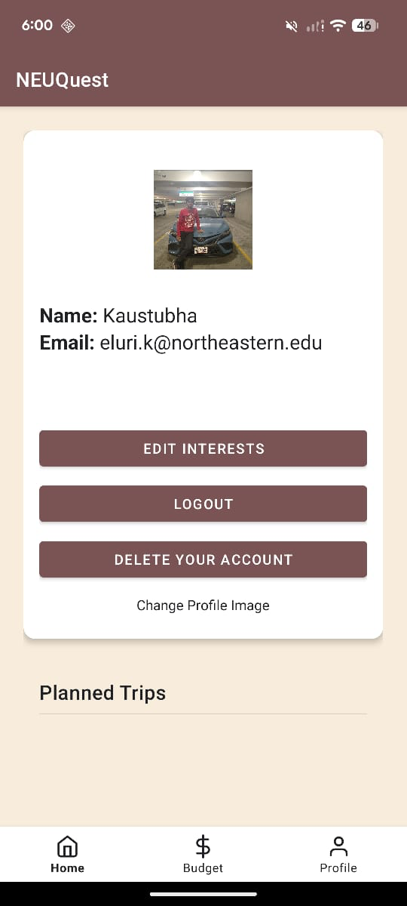
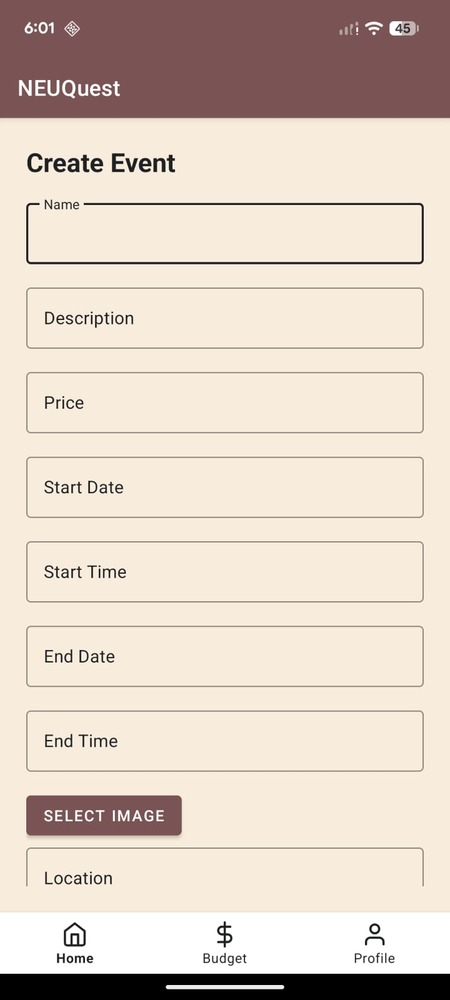

# NEUQuest 🎯

**Where Budget Meets Adventure**

NEUQuest is the ultimate companion for budget-conscious students at Northeastern University. Discover affordable travel destinations and dining options tailored to your interests and dietary requirements. Our app ensures that every adventure is both exciting and wallet friendly. Whether you're looking to explore new cities or find the best local eats, NEUQuest has you covered. Plan your trips effortlessly, get personalized recommendations, and enjoy exclusive student deals. Join NEUQuest today and let your budget meet adventure!

---

## 📱 Project Overview

NEUQuest is specifically designed for budget travelers enrolled at Northeastern University, providing a unique platform that combines affordable travel discovery with personalized dining recommendations. Unlike generic travel apps, NEUQuest focuses exclusively on the Northeastern University student community, offering tailored experiences and exclusive student deals.

---

## ✨ Key Features

### 🎯 Areas of Deep Exploration

#### 1. Dynamic User Types and Roles
- Different user types and admin roles to manage and dynamically affect shared data
- Role-based access control for content management
- Admin dashboard for platform oversight
- Collaborative planning with multiple users working on shared travel plans
- Real-time editing, commenting, and task assignment capabilities

#### 2. Messaging System
- Users can report suspicious content directly to admin roles for quick action
- Real-time communication between users and administrators
- Content moderation workflow

#### 3. Personalized Recommendations
- User-selected interests drive event and activity recommendations
- Interest-based event discovery
- Tailored travel destination suggestions
- AI-powered feed ranking via Google Gemini

#### 4. Event Details and Budgeting
- Event details (location, cost) matched to user budget ranges
- Budget-conscious trip planning with min/max budget settings
- Include/exclude meals and transportation in budget calculations
- Automatic event matching based on trip dates, location, and budget constraints

#### 5. User Engagement
- Track events users register for to algorithmically fine-tune their home feed
- Personalized content curation powered by Gemini
- Comment system for community engagement

### 🔐 User Authentication & Profiles
- Secure Firebase Authentication with mandatory email verification
- User profile management with customizable interests and campus selection
- Profile photo upload from camera or gallery
- Email verification reminders

### 🎪 Event & Destination Discovery
- **Right Now**: Discover events happening in real-time with AI-ranked feed
- **Explore**: Browse events by category (Art, Nature, Photography, Travel, Music, Movies, Food, Sports)
- Event details with images, location, pricing, and registration links
- Comment system for community engagement
- Event reporting and admin moderation

### 🗺️ Trip Planning
- Create personalized trips with date ranges and locations
- Budget management with min/max budget range slider
- Include/exclude meals and transportation in budget calculations
- Automatic event matching based on trip dates and location
- Timeline view for visualizing trip schedules
- Add multiple events to a single trip
- AI-generated trip names via Google Gemini

### 🛠️ Admin Features
- Admin console for event moderation
- Approve or remove reported events
- Role-based admin access controlled at signup

---

## 🛠️ Technology Stack

### Core Technologies
| Area | Technology |
|------|-----------|
| Language | Java 8 |
| Platform | Android API 27+ (Target API 34) |
| Build System | Gradle with Kotlin DSL |
| Architecture | MVC with MVVM infrastructure (ViewBinding + Lifecycle) |

### Backend & Services
| Service | Usage |
|---------|-------|
| Firebase Authentication | Email/password auth, email verification |
| Firebase Realtime Database | Real-time data sync with offline persistence |
| Firebase Storage | Event and profile image storage |
| Google Gemini 1.5 Flash | AI trip naming and event recommendations |

### Libraries & Dependencies
| Library | Purpose |
|---------|---------|
| Glide | Asynchronous image loading and caching |
| Picasso | Image loading for profile and event images |
| Material Design 3 | UI components and theming |
| VipulaSri TimelineView | Trip itinerary timeline visualization |
| Guava | Async futures for Gemini API calls |
| AndroidX Lifecycle | ViewBinding and LiveData infrastructure |
| WorkManager | Background task scheduling |
| Espresso / JUnit | UI and unit testing |

---

## 📁 Project Structure

```
NEUQuest/
├── app/
│   ├── build.gradle.kts
│   └── src/
│       ├── main/
│       │   ├── AndroidManifest.xml
│       │   └── java/edu/northeastern/numad24su_group9/
│       │       ├── NEUQuestApplication.java       ← App entry point (Firebase init)
│       │       ├── MainActivity.java
│       │       ├── LoginActivity.java
│       │       ├── SignUpActivity.java
│       │       ├── RightNowActivity.java
│       │       ├── PlanningTripActivity.java
│       │       ├── EventDetailsActivity.java
│       │       ├── TripDetailsActivity.java
│       │       ├── ProfileActivity.java
│       │       ├── InterestsActivity.java
│       │       ├── RegisterEventActivity.java
│       │       ├── AddEventsActivity.java
│       │       ├── AdminConsole.java
│       │       ├── AppConstants.java
│       │       ├── NotificationHelper.java
│       │       ├── CurrencyInputFilter.java
│       │       ├── model/
│       │       │   ├── Event.java
│       │       │   ├── Trip.java
│       │       │   ├── User.java
│       │       │   └── Comment.java
│       │       ├── firebase/
│       │       │   ├── AuthConnector.java
│       │       │   ├── DatabaseConnector.java
│       │       │   ├── StorageConnector.java
│       │       │   └── repository/
│       │       │       ├── database/
│       │       │       │   ├── EventRepository.java
│       │       │       │   ├── TripRepository.java
│       │       │       │   └── UserRepository.java
│       │       │       └── storage/
│       │       │           ├── EventImageRepository.java
│       │       │           └── UserProfileRepository.java
│       │       ├── gemini/
│       │       │   └── GeminiClient.java
│       │       └── recycler/
│       │           ├── EventAdapter.java
│       │           ├── TripAdapter.java
│       │           ├── CommentsAdapter.java
│       │           ├── TimelineEventAdapter.java
│       │           └── AdminConsoleAdapter.java
│       └── test/
│           └── java/.../ExampleUnitTest.java      ← 30 unit tests
└── gradle/
    └── libs.versions.toml
```

---

## 🔧 Recent Improvements

### Bug Fixes
| Bug | Fix |
|-----|-----|
| `GeminiClient.generateResult()` created a new `GeminiClient` inside itself, ignoring `this` | Fixed to use `model` directly |
| `PlanningTripActivity.onResume()` crashed with NPE on first launch | Added null guards — `onPause()` hadn't run yet so fields were null |
| Budget slider read values before `setValueFrom/setValueTo` was configured | Corrected initialization order |
| `RightNowActivity` set the register-event click listener twice | Removed the duplicate |
| `AddEventsActivity.confirmSelection()` called `finish()` twice before `startActivity()` | Removed the premature `finish()` |
| `EventDetailsActivity` auto-unboxed a nullable `Boolean` for `isReported` → NPE | Changed to `Boolean.TRUE.equals(...)` |
| `Trip.addEventID()` threw NPE when `eventIDs` was null | Lazy-initializes the list |
| All `toString()` methods missing separators between fields | Added `, ` between every field |

### Performance
- **DiffUtil in all 5 RecyclerView adapters** — all adapters now extend `ListAdapter<T, VH>` with a `DiffUtil.ItemCallback`. Previously, `updateData()` / `updateTrips()` / `updateList()` set the list without ever calling notify, so the UI never updated unless `setAdapter()` was called again
- `EventAdapter` — removed unnecessary `ExecutorService` + `Handler` wrapping Glide (Glide handles threading natively)
- `AdminConsoleAdapter` — fixed stale adapter-position capture in click listeners; now uses `holder.getAdapterPosition()` and `submitList()` for removes

### Memory & Reliability
- **Firebase listener leak fixed** — `EventDetailsActivity` comments `ValueEventListener` is now stored as a field and unregistered in `onStop()`
- **`RightNowActivity.filterEvents()`** — replaced a new `HandlerThread` spawned on every keystroke with a simple in-memory filter on the main thread (no I/O — no thread needed)
- **`ThreadPoolExecutor` lifecycle** — executors in `PlanningTripActivity` and `RightNowActivity` are now fields shut down in `onDestroy()`

### Architecture
- **`NEUQuestApplication`** — new `Application` class that enables Firebase disk persistence (`setPersistenceEnabled(true)`) for offline support, and initializes the notification channel at startup
- **`AppConstants`** — converted from an interface (anti-pattern) to a `final class` with a private constructor; added `PREFS_USER_INFO`, `BUDGET_SLIDER_MIN/MAX/STEP`, `BACK_PRESS_INTERVAL_MS`, `RECYCLER_VIEW_CACHE_SIZE`, `REQUEST_CAMERA_PERMISSION`, and NEU email domain constants
- All `"UserInfo"` SharedPreferences string literals replaced with `AppConstants.PREFS_USER_INFO` across 6 files
- `User.isAdmin` field visibility fixed from `public` to `private`
- **ViewBinding** enabled in `build.gradle.kts`
- **AndroidX Lifecycle** (ViewModel + LiveData) dependencies added

### Code Quality
- `SignUpActivity` email validation extracted to a static `isValidNeuEmail(String)` method
- Duplicate `google-services` plugin application removed from `build.gradle.kts`
- `libs.versions.toml` version string typos fixed (`workRuntimeKtx` had a trailing quote; `work-runtime-ktx` module name had a leading quote)

### Testing
- `ExampleUnitTest.java` replaced with **30 real unit tests** covering:
  - `Event.isWithinDateRange` — 8 cases including boundary dates and cross-year ranges
  - `Event.compareTo` / sort ordering — 4 cases
  - `RightNowActivity.extractTitles` — 4 regex cases
  - `SignUpActivity.isValidNeuEmail` — 5 cases including spoofed domains
  - `Trip.addEventID` null safety — 2 cases
  - `AppConstants` value sanity checks — 4 cases

---

## 🚀 Getting Started

### Prerequisites
- Android Studio Hedgehog or later
- JDK 8 or higher
- Android SDK (API 27+)
- Firebase project with Authentication, Realtime Database, and Storage enabled

### Installation

1. **Clone the repository**
   ```bash
   git clone https://github.com/Kaustubha-09/NEUQuest.git
   cd NEUQuest
   ```

2. **Set up Firebase**
   - Create a Firebase project at [Firebase Console](https://console.firebase.google.com/)
   - Enable Authentication (Email/Password)
   - Enable Realtime Database
   - Enable Storage
   - Download `google-services.json` and place it in the `app/` directory

3. **Build and Run**
   ```bash
   ./gradlew assembleDebug
   ```
   Or use Android Studio's built-in build and run functionality.

4. **Run unit tests**
   ```bash
   ./gradlew test
   ```

---

## 👥 Team

**Group 9 - Northeastern University**

- **Agllai Papaj**
- **Harshitha Chava**
- **Kaustubha Eluri**
- **Sampada Kulkarni**
- **Winston Heinrichs**

---

## 🎯 Target Users

Budget travelers enrolled at Northeastern University seeking affordable travel destinations and dining options tailored to their interests and dietary requirements.

---

## 🏆 Competitors & Market Analysis

### Competitors

1. **Wanderlog** — Trip planning app to build an itinerary. Users have complained about navigation difficulties and the cumbersome process of editing itineraries.

2. **Tripadvisor** — Compares hotel prices from over 200 booking sites worldwide. Criticized for outdated reviews and listings of permanently closed establishments.

3. **Other Travel Planning Apps** — Various apps offer similar features but lack the exclusive focus on Northeastern University students that NEUQuest provides.

### NEUQuest's Competitive Advantage
- Exclusive focus on Northeastern University students
- Budget-conscious approach with student deals
- AI-powered personalized recommendations (Google Gemini)
- Real-time, up-to-date information via Firebase
- Offline support via Firebase disk persistence

---

## 🔒 Security & Privacy

- Email verification required for all accounts before accessing the app
- Only `@northeastern.edu` and `@husky.neu.edu` email addresses accepted at signup
- Secure Firebase Authentication
- User-reported content moderation with admin oversight
- `google-services.json` and `GeminiClient.java` excluded from version control

---

## 🎨 UI/UX Design & Development Process

### Initial Wireframes

Our design process began with comprehensive wireframes that mapped out the core user flows:

<table>
<tr>
<td width="50%">

**Itinerary Planning Flow**


Wireframes showing the complete flow from adding activities, inputting event details (name, location, time, budget, category), viewing daily itineraries with timeline visualization, and accessing detailed event information screens.

</td>
<td width="50%">

**Budget Travel Planning Flow**


Complete budget travel workflow: budget input with travel/meal options, budget allocation visualization with pie charts, event discovery with search and filters, and itinerary timeline with chronological activity scheduling.

</td>
</tr>
</table>

### Prototypes

<table>
<tr>
<td width="50%">

**Prototype 1: Main Feed/Discovery Page**


Location-based event discovery with dual location selector, prominent event cards showing venue, date/time, and details, plus bottom navigation with Explore, Alerts, Add, and Profile options.

</td>
<td width="50%">

**Prototype 2: Deals & Events Feed**


Student-focused deals feed with search bar, interest-based filters, and vertical cards showcasing student discounts, events, and grocery deals with action buttons.

</td>
</tr>
</table>

### User Testing & Iterations

Based on user feedback, we implemented several key enhancements:

<table>
<tr>
<td width="50%">

**Collaborative Planning Feature**


Enables multiple users to collaborate on travel plans with real-time editing, commenting, task assignment, and version control.

</td>
<td width="50%">

**Like/Dislike System**


Like/dislike buttons on the "Right Now" page allow users to express sentiment towards events and enable algorithmic fine-tuning of the personalized feed.

</td>
</tr>
</table>

### Design Principles

- **Budget-First**: Budget information is prominently displayed throughout the app
- **Student-Centric**: Exclusive focus on student deals and the Northeastern University community
- **Intuitive Navigation**: Clear bottom navigation with consistent iconography
- **Timeline Visualization**: Visual representation of schedules and itineraries
- **Personalization**: Interest-based filtering and AI-powered recommendations throughout

**Additional Design Wireframe**



---

## 📸 Live Demo Screenshots

<table>
<tr>
<td width="50%">

**Welcome & Authentication**


Clean welcome interface with sign up and login options, featuring NEUQuest's distinctive beige and brown color scheme.

</td>
<td width="50%">

**User Profile**



Profile management screen with user information, profile picture, interest editing, account controls, and planned trips overview.

</td>
</tr>
<tr>
<td width="50%">

**Budget Planning**


Intuitive budget planning with range slider for min/max budget, meal and transport options, plus trip date/time/location inputs.

</td>
<td width="50%">

**Event Creation**



Comprehensive event creation form with name, description, pricing, scheduling, location, and image upload capabilities.

</td>
</tr>
</table>

---

## 🎯 Future Enhancements

- Push notifications for event reminders (FCM integration)
- Full MVVM migration — ViewModels and LiveData for all screens
- Google Maps integration for event locations
- Social features (friends, shared trips)
- Advanced filtering and search
- Calendar app integration
- Weather integration for trip planning
- Reviews and ratings system
- CI/CD pipeline with GitHub Actions

---

## 📝 Course Information

**Course**: Mobile Application Development (NUMAD24Su)
**Institution**: Northeastern University
**Semester**: Summer 2024

---

## 📄 License

This project was developed as part of a university course assignment.

---

## 🤝 Contributing

This project was developed as a collaborative effort for academic purposes. For questions or feedback, please contact the team members listed above.

---

**Built with ❤️ by Group 9**
